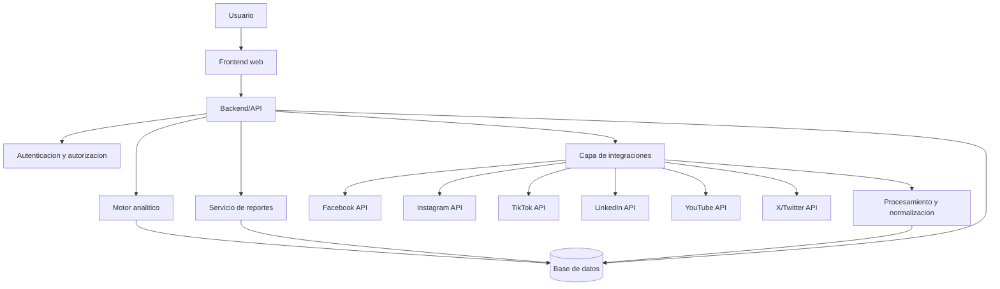
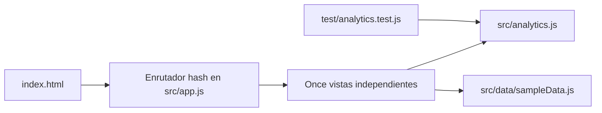

# Arquitectura

## Estado

Arquitectura objetivo definida. El MVP actual implementa frontend estatico modular con motor analitico local y datos demo. Las capas de backend, persistencia e integraciones se implementaran en fases posteriores.

## Diagrama general objetivo



## Componentes

- Frontend web: dashboard, filtros, tablas, recomendaciones, reportes e integraciones.
- Backend/API: reglas de negocio, autorizacion, orquestacion de datos y exposicion de endpoints.
- Capa de integracion: conectores independientes por red social.
- Motor analitico: formulas, auditoria, deteccion de anomalias, rankings e insights.
- Base de datos: usuarios, roles, cuentas, publicaciones, metricas, historicos, reportes y actividad.
- Servicio de reportes: generacion de informes ejecutivos.

## Comunicacion entre modulos

El flujo previsto es:

```text
Frontend -> Backend -> Servicio de integracion -> API social -> Procesamiento -> Base de datos -> Dashboard
```

## Servicios externos

APIs oficiales de redes sociales. La disponibilidad de metricas depende de cada API y del nivel de permisos aprobado.

## Arquitectura del frontend v0.2.0



El enrutamiento por hash mantiene una sola carga de aplicacion, pero cada opcion del menu reemplaza completamente el contenido de `view-root`. Esto evita apilar modulos en una unica pagina y permite enlazar directamente rutas como `#/auditoria`, `#/metricas` y `#/contenido`.
