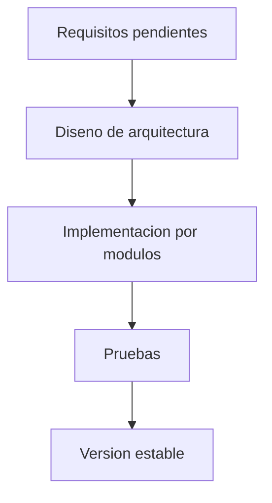

# Arquitectura

## Estado

Pendiente de definicion. No se ha seleccionado arquitectura porque aun no se conocen los requisitos concretos del sistema.

## Diagrama general preliminar

## Componentes

Pendiente de definicion.

## Comunicacion entre modulos

Pendiente de definicion.

## Servicios externos

Pendiente de definicion.
