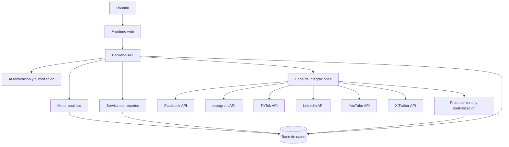
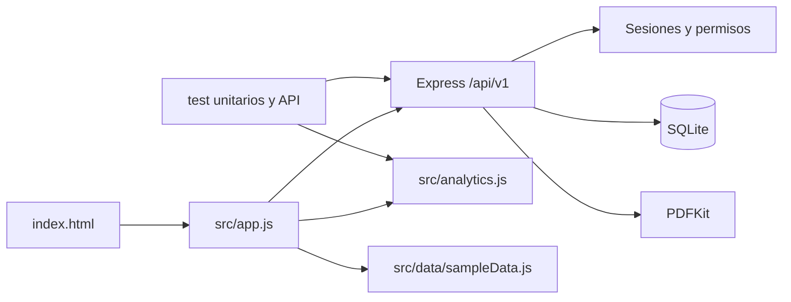

# Arquitectura

## Estado

Arquitectura por capas implementada en v0.3.0 para frontend, API, autenticacion, persistencia, analitica y reportes. La capa de integraciones soporta configuracion cifrada e importacion persistente; los conectores OAuth oficiales siguen en desarrollo.

## Diagrama general objetivo



## Componentes

- Frontend web: dashboard, filtros, tablas, recomendaciones, reportes e integraciones.
- Backend/API: reglas de negocio, autorizacion, orquestacion de datos y exposicion de endpoints.
- Capa de integracion: conectores independientes por red social.
- Motor analitico: formulas, auditoria, deteccion de anomalias, rankings e insights.
- Base de datos: usuarios, roles, cuentas, publicaciones, metricas, historicos, reportes y actividad.
- Servicio de reportes: generacion de informes ejecutivos.

## Comunicacion entre modulos

El flujo previsto es:

```text
Frontend -> Backend -> Servicio de integracion -> API social -> Procesamiento -> Base de datos -> Dashboard
```

## Servicios externos

APIs oficiales de redes sociales. La disponibilidad de metricas depende de cada API y del nivel de permisos aprobado.

## Arquitectura implementada v0.3.0



El enrutamiento por hash mantiene una sola carga de aplicacion, pero cada opcion del menu reemplaza completamente el contenido de `view-root`. Esto evita apilar modulos en una unica pagina y permite enlazar directamente rutas como `#/auditoria`, `#/metricas` y `#/contenido`.

El backend se crea desde `src/server/app.js`; `server.js` solo carga el entorno, abre la base y administra el ciclo de vida. Las rutas se separan por autenticacion, usuarios, integraciones, analitica y reportes. Esta estructura permite probar la API en memoria sin iniciar un puerto real.
