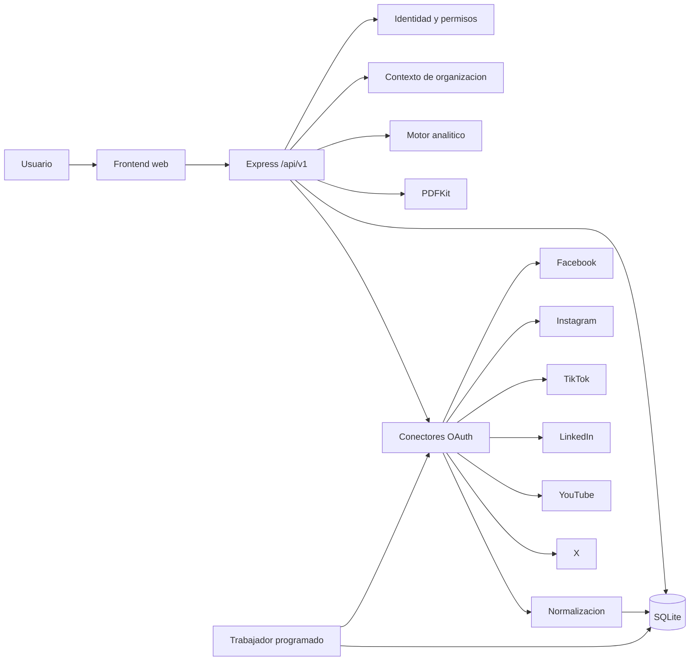

# Arquitectura

## Estado

Arquitectura modular por capas implementada para frontend, API, identidad, organizaciones, persistencia, analitica, reportes, conectores y sincronizacion. La version v0.5.3 mantiene SQLite y una demostracion estatica independiente; refuerza concurrencia y aislamiento sin migrar a una arquitectura multiserver.

## Vista general



## Capas

Desde v0.5.4, el portal cliente es una presentacion simplificada por rol sobre la misma identidad y organizacion. POST `/analytics/dashboard/refresh` reutiliza el ejecutor con permiso de lectura, contexto de sesion, CSRF y limite persistente por conexion; no concede permisos de configuracion. Los portales no duplican las bases de usuarios.

- Presentacion: `index.html`, `src/app.js` y `src/styles.css`.
- Analitica: `src/analytics.js` y datos demostrativos en `src/data/`.
- API: composicion en `src/server/app.js` y rutas en `src/server/routes/`.
- Identidad: sesiones, CSRF, roles, verificacion de correo, recuperacion y MFA.
- Organizaciones: membresias y organizacion activa en cada sesion.
- Integraciones: adaptadores independientes en `src/server/integrations/`.
- Persistencia: SQLite, migraciones SQL y cifrado de secretos.
- Procesamiento: `sync-worker.js` y la ruta manual usan `sync-service.js` para reclamar, renovar y validar el bloqueo antes de persistir. La escritura y el avance de la programacion comparten transaccion.
- Reportes: almacenamiento de informes y generacion PDF.
- Recuperacion: `backups.js` usa backup online, AES-GCM y validacion SQLite; `backup-worker.js` programa copias opcionales. La CLI no expone respaldos por HTTP.
- Observabilidad desde v0.5.2: `observability.js` mide solicitudes antes del parser y autenticacion, genera correlacion y emite logs JSON con campos permitidos. Las metricas no consultan SQLite y requieren una clave exclusiva del operador.

## Flujo oficial de datos

```text
Usuario -> OAuth -> proveedor -> normalizacion -> historicos persistentes -> API analitica -> vistas
```

Cada adaptador devuelve el mismo contrato: cuenta, metricas, publicaciones, tokens renovados y fecha de sincronizacion. `oauth-storage.js` cifra tokens y realiza escrituras idempotentes. El frontend no recibe secretos.

## Separacion de vistas

El enrutamiento por hash mantiene una sola carga de aplicacion, pero cada ruta reemplaza completamente `view-root`. Auditoria, Metricas, Contenido y los demas modulos son pantallas independientes y enlazables.

## Ejecucion local y publica

- Local: `server.js` abre la base, construye proveedores, inicia el trabajador y sirve frontend y API.
- Publica: `npm run build` genera `dist/` sin backend, sesiones, secretos ni datos privados.
- Produccion: existe una imagen Docker y un Compose de referencia para una unica instancia. La alta disponibilidad real requiere reemplazar SQLite por una base compartida y una cola administrada.

## Escalabilidad

Las sesiones, intentos de acceso y tareas programadas ya viven en base de datos; el trabajador usa arrendamientos para evitar duplicados. Esta es una preparacion, no una garantia de alta disponibilidad. SQLite y su archivo local siguen siendo el limite principal para multiples servidores.
