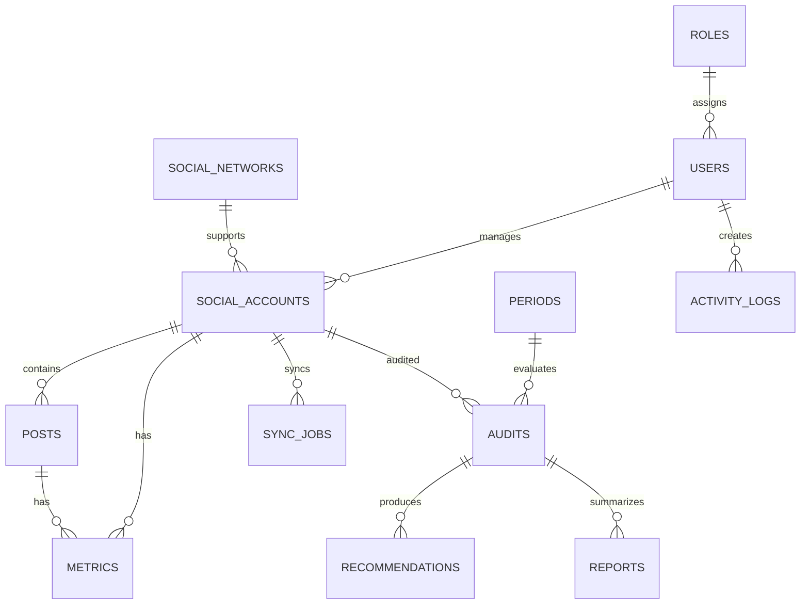

# Base de datos

## Estado

Persistencia SQLite implementada mediante `better-sqlite3`. La migracion `migrations/001-initial.sql` se aplica al abrir la base y activa claves foraneas y modo WAL.

## Entidades principales

- users: usuarios del sistema.
- roles: roles y permisos.
- sessions: sesiones autenticadas con hash del token y expiracion.
- social_platforms: redes sociales soportadas.
- integrations: configuracion y secretos cifrados por plataforma.
- social_accounts: cuentas conectadas o importadas.
- posts: publicaciones analizadas.
- metric_snapshots: metricas historicas por cuenta y fecha.
- reports: reportes ejecutivos.
- sync_runs: ejecuciones de importacion o sincronizacion.
- activity_logs: registro de acciones relevantes.

## Relaciones

## Restricciones implementadas

- No guardar contrasenas de redes sociales.
- Tokens de API cifrados.
- Historicos preservados por periodo.
- Evitar duplicidad usando identificadores externos por red social y cuenta.
- Registrar fecha de ultima sincronizacion.
- Eliminar sesiones relacionadas al eliminar un usuario.
- Aplicar unicidad a correo, plataforma e identificadores externos.

Los resultados de auditoria y recomendaciones se guardan actualmente dentro del contenido JSON de cada reporte. Su normalizacion en tablas propias queda prevista para una fase posterior.
