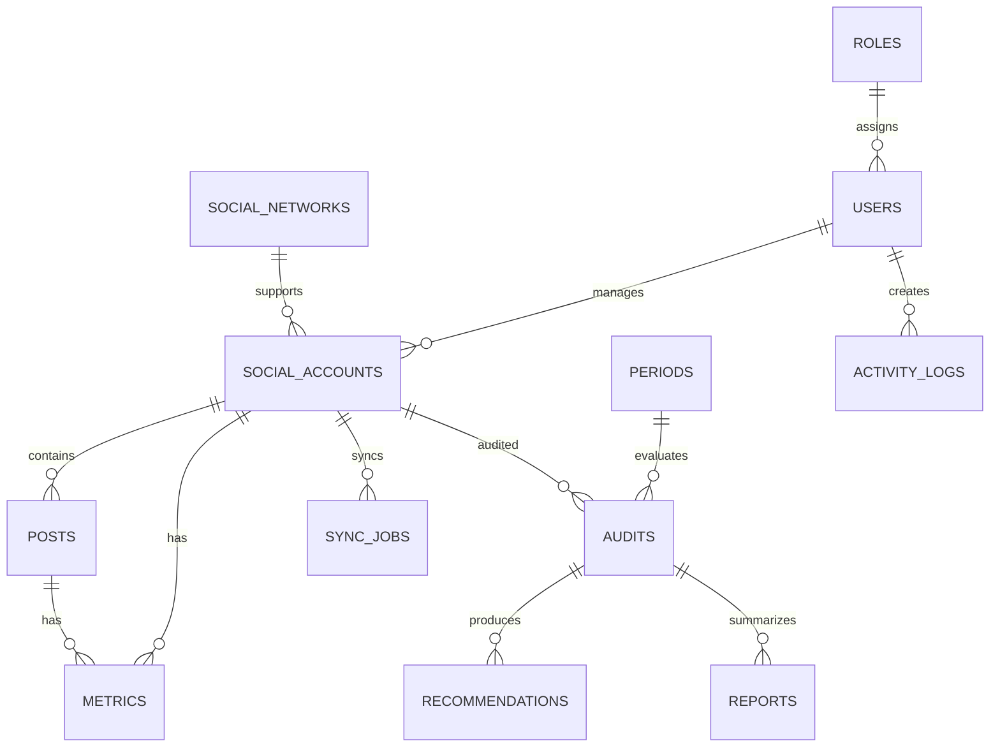

# Base de datos

## Estado

Diseno conceptual inicial. El MVP aun no implementa persistencia real.

## Entidades principales

- users: usuarios del sistema.
- roles: roles y permisos.
- social_networks: redes sociales soportadas.
- social_accounts: cuentas conectadas o importadas.
- posts: publicaciones analizadas.
- metrics: metricas historicas por cuenta, publicacion y periodo.
- periods: rangos de analisis.
- audits: resultados de auditoria.
- recommendations: recomendaciones generadas.
- reports: reportes ejecutivos.
- sync_jobs: sincronizaciones con APIs.
- activity_logs: registro de acciones relevantes.

## Relaciones

## Restricciones iniciales

- No guardar contrasenas de redes sociales.
- Tokens de API cifrados.
- Historicos preservados por periodo.
- Evitar duplicidad usando identificadores externos por red social y cuenta.
- Registrar fecha de ultima sincronizacion.
