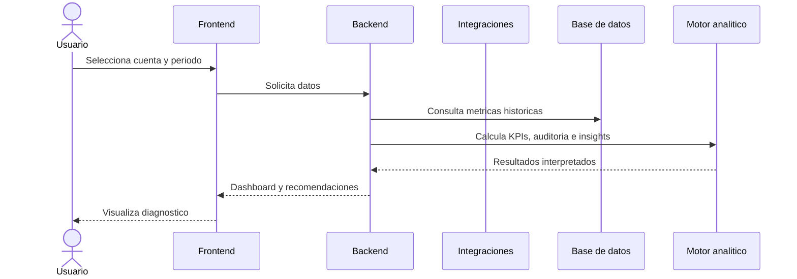

# Flujos del sistema

## Flujo de analisis objetivo

## Flujo de sincronizacion objetivo

1. El usuario autorizado conecta una cuenta mediante mecanismo oficial.
2. El sistema almacena token de forma segura.
3. El servicio de integracion solicita metricas disponibles.
4. El procesamiento normaliza datos y detecta metricas no disponibles.
5. La base de datos guarda historicos y ultima sincronizacion.
6. El dashboard informa fecha y estado de actualizacion.

## Flujo del MVP actual

1. El usuario abre el dashboard.
2. La aplicacion carga datos demo locales.
3. El motor analitico calcula KPIs, auditoria, rankings, anomalias y recomendaciones.
4. Los filtros actualizan la interfaz dinamicamente.
