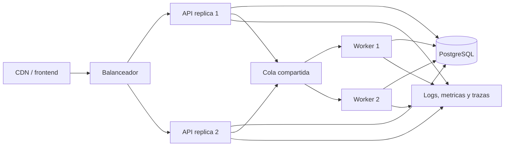

# Produccion y alta disponibilidad

## Preparacion incorporada

- Configuracion por variables de entorno.
- Validacion de HTTPS y secreto de cifrado en produccion.
- Contenedor y Compose de una instancia.
- Sesiones y limitador de acceso persistentes.
- Tareas programadas con arrendamientos.
- Endpoints de vida y disponibilidad.
- Apagado ordenado de HTTP, trabajador y base.
- Frontend estatico separable del backend.

## Lo que todavia impide multiples servidores

- SQLite usa un archivo local y no es una base compartida para replicas.
- No existe una cola externa para distribuir sincronizaciones.
- Los archivos generados y copias no estan en almacenamiento de objetos.
- No hay balanceador, descubrimiento, metricas, trazas ni alertas.
- Las migraciones no tienen aun un proceso coordinado entre replicas.

## Arquitectura objetivo

## Plan recomendado

1. Extraer una interfaz de persistencia y portar consultas a PostgreSQL.
2. Ejecutar migraciones en CI/CD antes de cambiar replicas.
3. Mover sincronizaciones a una cola con reintentos e idempotencia.
4. Anadir almacenamiento de objetos para exportaciones si se conservan.
5. Configurar copias, restauracion, monitoreo y alertas.
6. Probar fallos de instancia, perdida de red y recuperacion de base.

Hasta completar estos pasos, el despliegue recomendado es una unica instancia con volumen persistente y copias frecuentes.
